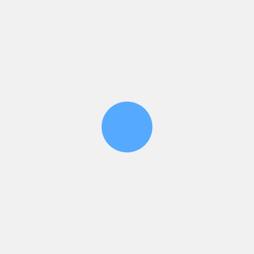
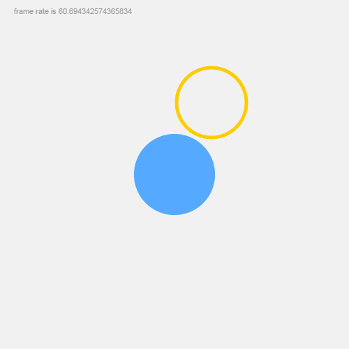
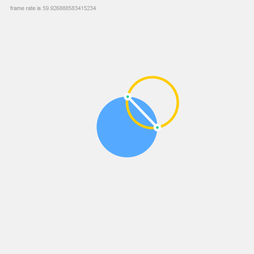

# Pt: A quick start guide

This guide discusses the main concepts of Pt, and walks through the code to create a simple interactive sketch with Pt.

**If you are learning to code, 
there's also [a friendlier, non-technical guide](https://medium.com/@williamngan/758f2e082da5) to get you started.**

As you know, Pt is based on the ideas of *Point*, *Form*, and *Space*. So we'll be creating a space, a form, and a point (and their extensions). 

### 0. Spoiler!
Here's [the thing](http://williamngan.github.io/pt/docs/start.html) we'll be building, and here's the [final source code](https://github.com/williamngan/pt/blob/master/docs/start.html). 
Pretty fun with less than 40 lines of code, right?


### 1. Setting up and drawing a point

The simplest way to create a space is to use CanvasSpace, which is included in the core library.

```javascript
var space = new CanvasSpace().display();
```

This assumes you have, in your html, a container element with id="pt". For example `<div id="pt"></div>`. 
The code above will try to find that element, and create a `<canvas>` element inside it.

You can also specify the canvas id and background color, along with a specific container element.

```javascript
var space = new CanvasSpace("hello", "#f1f1f1").display( "#pt" );
```

The code above will create a light-grey canvas with id "hello", and put it inside a container element with id "pt".

After creating a space, we will create a *Form* to work with that space. A form is like a brush, a way of visualizing the points.
The *Form* class works with html canvas and draws basic shapes. We create an instance of it by passing `space` into it.

```javascript
var form = new Form(space);
```

You may realize that *Space* and *Form* can be extended to create different kinds of expressions in different media. 
Can it control a robot to graffiti a clumsy circle on a wall? It's possible!

Now let's create a point. Just a simple point.

```javascript
var dot = new Point( 250, 250 );
```

How do we put this point into space and draw it with the form we just created? 
All instances of Space let you add objects into it, as long as the object includes an `animate` callback function. 
Each object is like an actor, keeping track of time and doing dramatic stuff. Let's create one such object.

```javascript
var bot = {
    animate: function( time, fs, context ) {
        form.point( dot ); // the bot will use form to draw a point
    }
};

space.add( bot ); // adding the bot object into space
space.play();
```

The animate function has 3 parameters: `time` which keeps track of time elapsed in milliseconds, `fs` tells you the milliseconds passed since last frame (ie, frame-rate is `1000/fs`), and `context` is the Space's context which is the canvas graphics context in this case.

Finally, we add the `bot` into space, and seeing that everything is ready, we call `space.play()` to start. If you see a gray point appears in your canvas, you're doing it right!


### 2. Drawing a circle and making it move

Too boring? Let's change the dot to a `Circle`. 

```javascript
var dot = new Circle( 250, 250 ).setRadius( 50 );
    
var bot = {
    animate: function( time, fs, context ) {
        form.fill( "#5AF" ).stroke( false );
        form.circle( dot );
    }
};
```

As you can see, everything is almost the same, except the dot is now a circle with 50px radius. And we apply Form's `fill()` and `stroke()` functions to color the circle blue with no stroke.

A side note: Form's functions can usually be chained together. For instance, you can also write this as  `form.fill(...).stroke(...).circle(dot)`.

Still kind of dull, right? Let's animate this dot.

```javascript
var bot = {
    animate: function( time, fs, context ) {
        
        form.fill( "#999" );
        form.text( new Point( 20, 20 ), "frame rate is "+(1000/fs) ); // draw frame rate as text

        form.fill( "#5AF" ).stroke( false );
        dot.setRadius( Math.abs(500 - time % 1000)/20 + 20 ); // dynamic radius that pulsates based on time
        form.circle( dot );
        
    }
} 

```

Here we calculate the frame-rate and draw it as gray text on top-left corner. 
Then we change the dot's radius based on elapsing time so that it will pulsate between 20px to 45px.



Now let's add some interactivity. CanvasSpace allows you to keep track of mouse events, and it will pass those events to the added objects. The easiest way is to call `space.bindMouse()`, which will listen to common mouse events, and then pass the information into your object's callback function `onMouseAction`. Like this:

```javascript
var bot = {
    animate: function(time, fs, context) { 
        //...
    },

    onMouseAction: function(type, x, y, evt) {
        // Code to track mouse actions will go here
    }
}

space.add( bot );
space.bindMouse();
```

`onMouseAction` function's `type` parameter gives you a string indicating the mouse action, such as “move”, “drag”, “drop”, "up" and “down”. The parameters `x` and `y` then gives you the current mouse position on the canvas.

Let's draw another circle and make it move with the cursor.

```javascript
var another = new Circle( 100, 100 ).setRadius( 50 ); // another circle

var bot = {
    
    animate: function ( time, fs, context ) {
        // previous code omitted...
        form.fill( false ).stroke( "#fc0", 5 ); // another circle has orange stroke and no fill
        form.circle( another );
    },
    
    onMouseAction: function ( type, x, y, evt ) {
        if (type == "move") {
            another.set( x, y ); // set another circle's position
        }
    }
};

space.add( bot );
space.bindMouse();
space.play();
```

So in `onMouseAction`, we set the circle's position when mouse moves, and in `animate`, we draw the circle with an orange stroke color. Give it a try, and you should see the orange circle is now moving with your cursor.



### 3. Experimentation

We got the basics working, but what can we do with it? Dear reader, this is the place where the start guide ends and your imagination starts. What can you do with 2 circles, one pulsating and one moving?

Perhaps, you can check if the two circles intersect, and if so, draw 2 extra points or a line connecting the intersection points. It might look like this:

```javascript
animate: function ( time, fs, context ) {
    // previous code omitted...
    
    var hits = another.intersectCircle( dot );
    if (hits.length > 0) {
        form.stroke( "#fff" ).fill( "#0C9" );
        form.line( new Line( hits[0] ).to( hits[1] ) );
        form.points( hits, 5, true );
    }
}
```

*Inspiration: Casey Reas applied these simple intersections of circles to great effects, in his 2004 Whitney Museum commission "[Software Structures](http://artport.whitney.org/commissions/softwarestructures/)".*

Or what if you extend either *Form* or *Circle* to make them do special things? In es6 or coffeescript, you can simply do:

```javascript
class SuperCircle extends Circle
```
In plain old javascript, there's a convenient function in Pt to help with that:

```javascript
Util.extend( SuperCircle, Circle)
```

[This simple demo](http://williamngan.github.io/pt/demo/index.html?name=space.add) shows a simple example of an extended class. See [source code](https://github.com/williamngan/pt/blob/master/demo/space.add.js) for details.

I hope you'll enjoy Pt. Take a look at [demos](http://williamngan.github.io/pt/demo/?name=color.LABtoRGB) and [docs](http://williamngan.github.io/pt/docs/), and be fearless in experimentation!


[view](http://williamngan.github.io/pt/docs/start.html)
