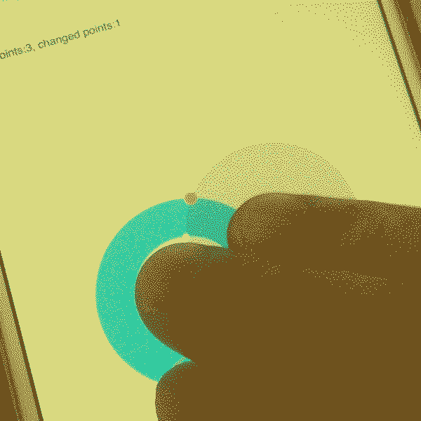

# Pt: Mobile Guide

Pt supports multi-touch and retina pixel scale, so it's pretty straightforward to extend your code for mobile browser.
This is a quick guide to get you started.


### Multi-touch
Similar to [`space.bindMouse`](../#func-Space-bindMouse), there's a convenient function to get touch events called [`space.bindTouch`](../#func-Space-bindTouch).
You may use both together to support both desktop and mobile browsers.

```language-javascript
var space = new CanvasSpace()
// ...
space.bindMouse()
space.bindTouch()
```

Then, for any objects you added to space,
you may provide a `onMouseAction` or `onTouchAction` to handle mouse or touch events respectively.
For example:

```language-javascript
space.add({
    animate: function(time, fps, context) {
        // implement animation logic
    },

    onMouseAction: function( type, x, y, evt ) {
        // types can be: "up", "down", "move", "drag", "drop", "over", and "out"
        if (type=="move") {
            // mouse moved
        }
    },

    onTouchAction: function( type, x, y, evt) {
        touchPoints = space.touchesToPoints( evt );

        // types can be: "up", "down", "move", and "out"
        if (type=="move" && touchPoints.length > 0) {
            // touched
        }
    }
});
```

It's that simple! Now your code will support interactions in both desktop and mobile browsers.

One thing to notice is the `space.touchesToPoints( evt )` function.
This is a convenient way to convert the points in `event.touches` to an array of Pt's `Vector` objects.
You can then count the number of multi-touches and track their positions.


### Retina display
Many phones offer a much higher resolution display than desktop monitors. As a result, a 1px line may look like 1px on desktop, but on mobile it may look like a blurry 2px.

If you are using `CanvasSpace`, Pt will try to determine the device's pixel scale, and adjust the canvas size automatically to make the graphics look sharp.

By default, this setting is turned on so you don't need to do anything. If you want to turn it off, pass a `retina` parameter in space's `setup` function.

```language-javascript
// turn off retina support, if you must
var space = new CanvasSpace().setup({retina: false});
```


### Testing on your phone
One of the easiest way to get a localhost running in your computer is to open Terminal (Mac) or CMD (Windows), and type these two lines:

```language-cmd
cd /path/to/your/folder
python -m SimpleHTTPServer 8001
```

The first line change the directory to a specific folder. (If you don't know the path, type "cd ", and then simply drag the folder from your Finder/Explore window to the Terminal/cmd)

The second line runs a simple server on port 8001 using python. Python may not be installed on Windows. You can download it at [https://python.org](https://python.org). Get the 2.7.x version.

If you open a desktop browser and access `http://localhost:8001`, you should see your folder contents there.

Next, open another Terminal or cmd, and then type `ifconfig` (Mac) or `ipconfig` (Windows). This will print out a bunch of stuff. Look for an address similar to `192.168.1.XX`.

Now go to your mobile browser, type in `http://192.168.1.XX:8001` (replace "XX" with your own address), and you should see the same thing in mobile. Done!


### Example
Access this page [http://williamngan.github.io/pt/demo](http://williamngan.github.io/pt/demo) from your mobile browser to see a multi-touch demo. The souce code is [here](https://github.com/williamngan/pt/blob/master/demo/circle.intersectCircle.mobile.js). Have fun!

